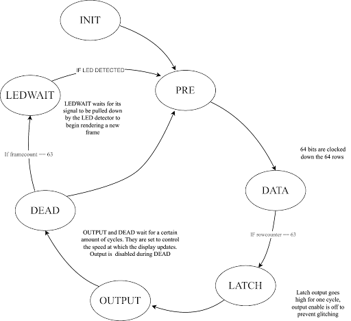
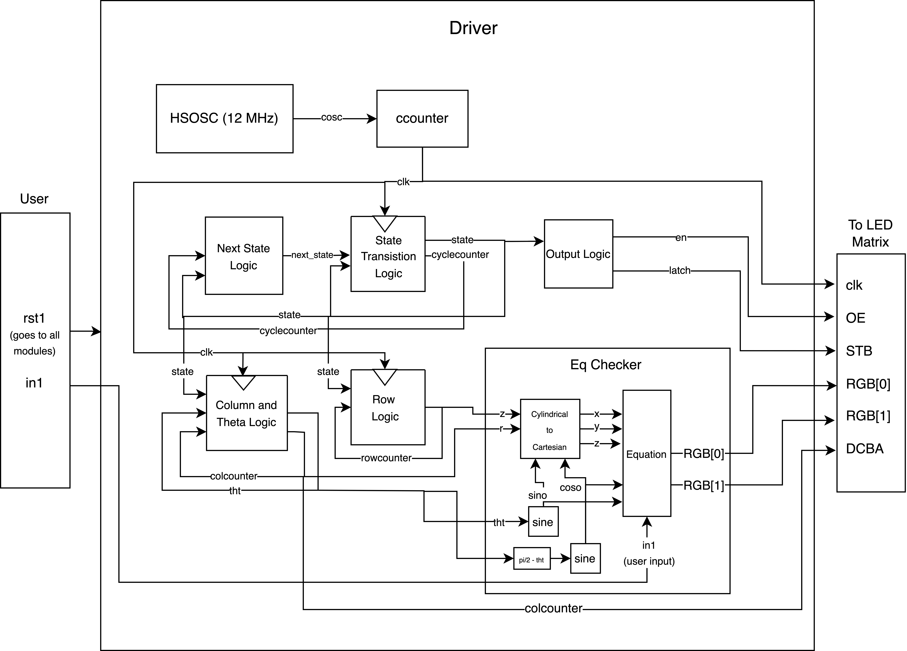

# MCU Design
The most important function of the MCU in the project was to ensure a constant rate of rotation. Without constant rotation, the update rate of the LED array would lose synchronization with the motor, and each LED "pixel" would be placed in an incorrect location. Given this importance, much of the MCU functionality concerns motor control, which manifests in three modules: an encoder listener, a motor controller, and a set of timers. 

Another key function of the MCU is to monitor user input, which is achieved through the touch sensing controller (TSC).
### Encoder Listener
The job of the encoder listener is to record the signal coming from an incremental encoder that is mounted to the motor. When mounted on a spinning motor, incremental encoders generate a pulse train with a known number of pulses per revolution (PPR). The rotational rate of the motor at any time, required for precise motor control, can be extracted from the frequency of the produced pulse train. However, this frequency cannot easily be calculated in one step. The job of the encoder listener is to perform the first step of this frequency-extraction calculation, which is to track a sum (or "encoder count") that increments by one each time a pulse is measured. If this sum is sampled at a known rate, then the counts per sample period, or frequency, can be calculated. 
### Timers
Timer peripherals hold two important roles in this design, facilitating sampling and generating motor control effort. The sampling timer generates an interrupt at a constant frequency of 50 Hz. In this interrupt, the encoder count is sampled to calculate motor speed. The motor control timer generates a pulse width modulated (PWM) signal which is fed as an output to the motor. By changing the duty cycle of the PWM signal, the motor control effort can be varied. 
### Motor Controller
The motor controller interacts with the encoder listener and timers in order to update the motor control effort. Using the known motor speed from the sampling timer interrupt and some specified desired motor speed, the motor controller computes the error between current speed and desired speed. PID control is implemented to compute a new duty cycle that will result in a lower error. This duty is sent back to the motor control timer, which updates the motor control effort duty cycle to match. 
### Touch Sensing Controller
The touch sensing controller uses principles of capacative touch sensing to determine whether or not a user is interacting with one of the control buttons. This is done by  charging a "sensor" capacitor to Vdd and partially discharging it onto a second "sampling" capacitor. This process is repeated until the sampling capacitor voltage reaches Vdd, at which time the measurement is finished. The number of cycles required to charge the sampling capacitor to Vdd relates directly to the capacitance of the sensor capacitor. Because touching an electrode with your finger changes its capacitance this technique is applicable in touch sensing applications. 
The TSC was configured to perform the charge/discharge cycles, and testing was performed to determine how many cycles were required in touch and no-touch cases. A threshold value of 400 cycles was selected; acquisitions with cycles < 400 are considered button presses, and acquisitions with cycles > 400 are not. 
## MCU Block Diagram

# FPGA Design
The FPGA controls the output image of the volumetric display. The output is generated in 64 LED updates per array rotation, which are handled through two sub-systems: an equation checker and a contrl FSM. 
### Equation Checker
The desired image to be displayed is set in the equation checker. During each LED update, the equation checker evaluates whether each pixel should be on or off based on the current position of the LED array and the desired shape. Currently, arbitrary images are not supported, as the desired image must be inputted through mathematical functions (which makes geometric shapes ideal). 
### Control FSM
The control FSM cycles between a number of states that handle the operations necessary to drive the LED array. The state transition diagram below highlights the organization of these states. 
\
INIT: Reset state, LED array output disabled. Automatically cycles to PRE state.\
\
PRE: Null state entered at the beginning of every LED update state. LED array output disabled. Automatically cycles to DATA state.\
\
DATA: Data loading state. LED array output disabled. Loads the data for 1 LED. Remains in Data state for 64 cycles, until the data for all LEDs in a column have been loaded.\
\
LATCH: Data transmission state. LED array output disabled. Sends the LED data to the LED array.\
OUTPUT: Output state. LED array output enabled. Remains in this state for a number of cycles determined by the desired output time.\
\
DEAD: Dead-time state. LED array output disabled. Remains in this state for a number of cycles determine by the desired dead time. Note: Output time and Dead time must be compatible with the total allowable update time.\
\
LED-WAIT: Waiting state. LED array output disabled. This state is included to account for any error in synchronization between LED updates and array rotation rate. FSM remains in LEDWAIT state until the rotation is completed, at which point a phototransistor produces a signal that functions as a "rotation completed" flag. This wait state ensures that the LED update process begins at the same physical location every time so that pixels do not drift. 
## FPGA Block Diagram

