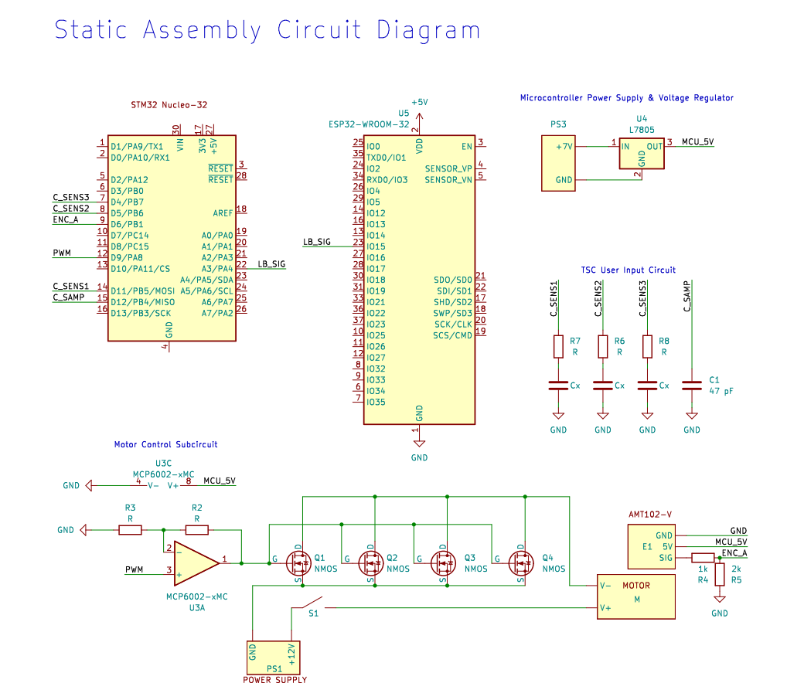

# Schematics
<!-- Include images of the schematics for your system. They should follow best practices for schematic drawings with all parts and pins clearly labeled. You may draw your schematics either with a software tool or neatly by hand. -->

# Source Code Overview
<!-- This section should include information to describe the organization of the code base and highlight how the code connects. -->

This project contains code for an Ice40UP5k FPGA (SystemVerilog), An STM32L432KCU MCU (C code), and two ESP32s (Arduino). 

The source code for the project is located in the Github repository [here](https://github.com/rafael-burger/led-display).

# Bill of Materials
<!-- The bill of materials should include all the parts used in your project along with the prices and links.  -->

| Item | Part Number | Quantity | Unit Price | Link |
| ---- | ----------- | ----- | ---- | ---- |
| Adafruit LED Array| 420 | 1 | $24.95 | [link](V_mQBiwXkTzIjjnVmYri2RjMWfYC0OBoC99sQAvD_BwE)
| Nucleo-32 Board |  Nucleo-L432KC | 1 | $10.32 |  [link](https://www.st.com/en/evaluation-tools/nucleo-l432kc.html#sample-buy)|
| Upduino FPGA Board | Upduino v3.1 | 1 | $30.00 | [link](https://tinyvision.ai/products/upduino-v3-1)|
| ESP32 Board | ESP32-WROOM-32 | 2 | $9.99 | [link](https://www.amazon.com/HiLetgo-ESP-WROOM-32-Development-Microcontroller-Integrated/dp/B0718T232Z) |
| Variable Power Supply | DROK 24V Power Supply | 1 | $39.99 | [link](https://www.amazon.com/Adjustable-DROK-110V-220V-Switching-Transformer/dp/B08GFSVHLS/ref=sr_1_3_pp?keywords=adjustable%2Bdc%2Bpower%2Bsupply&qid=1702058074&sr=8-3&th=1) |
| ---- | ----------- | ----- | ---- | ---- |
| ---- | ----------- | ----- | ---- | ---- |
| ---- | ----------- | ----- | ---- | ---- |
| ---- | ----------- | ----- | ---- | ---- |

| Power Mosfet | IPB144N12N3GATMA1 | 4 | $1.97 | [link](https://www.digikey.com/en/products/detail/infineon-technologies/IPB144N12N3GATMA1/2338056?s=N4IgTCBcDaIIwBYEDs5mSAugXyA) |
| Dual Op Amp | MCP6002-I/P | 1 | $0.44 | [link](https://www.digikey.com/en/products/detail/microchip-technology/MCP6002-I-P/500875) |

**Total cost: $14.95**
