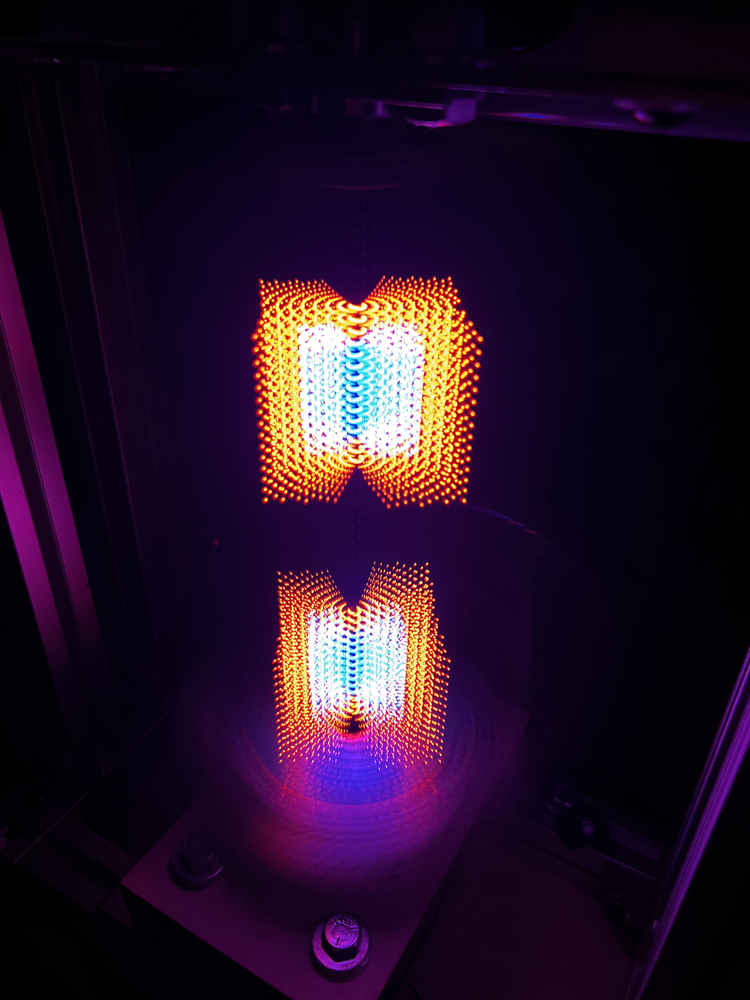

# Project Abstract

This website presents the ENGR-155 project completed by Rafael Burger and Tjaard Van Löben Sels. This project, inspired by [EvImnKey's similar project](https://www.reddit.com/r/arduino/comments/lmtdf9/this_is_my_take_at_a_hologram_for_my_bachelors/), aimed to provide a platform for displaying three-dimensional images. To achieve this effect, a two-dimensional array of LEDs was spun quickly along its long axis such that the plane of LEDs traced out a cylindrical volume. This LED array was then updated at many steps during each rotation to generate the desired image. 

# Project Motivation

From Star Wars' "help me Obi-Wan Kenobi..." to Blade Runner 2049's "you look lonely...", holograms have been an integral part of pop-culture's imagined futuristic realities. There seems to be some expectation, given the recurrence of the hologram, that an image should not be constrained to two dimensions, but rather should be interacted with in the same manner as physical objects. Whether or not you buy that take, you've got to admit that they look pretty cool. So why don't they exist in our every-day realities? It was with the goal of bringing this classic futuristic aesthetic into existence within our own lives that we began the project. The working principle of our design was inspired by the similar [work of EvImnKey](https://www.reddit.com/r/arduino/comments/lmtdf9/this_is_my_take_at_a_hologram_for_my_bachelors/) on reddit, who seems to be the only other person make public their work with a rotating light-plane for volumetric display. 

# System Block Diagram
