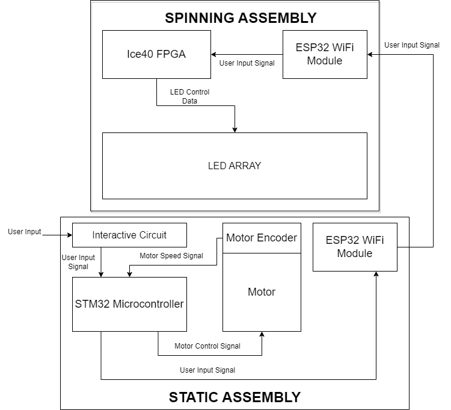

# Project Abstract

This website presents the project completed by Rafael Burger and Tjaard Van Löben Sels as a culmination to ENGR-155, microprocessor based systems. This project aimed to provide a platform for displaying three-dimensional images. To achieve this effect, a two-dimensional array of LEDs was spun quickly along its long axis such that the plane of LEDs traced out a cylindrical volume. This LED array was then updated at many steps during each rotation to generate the desired image. An Ice40 FPGA was used to drive LED array updates and a STM32 microcontroller was used to control the spin rate and listen for user input. Two ESP32 WiFi modules were used to facilitate wireless communication between the stationary components (microcontroller, user input circuit) and the spinning ones (FPGA, LED array).

# Project Motivation

From Star Wars' first "Help me Obi-Wan Kenobi..." to Blade Runner 2049's more recent "You look lonely...", holograms have been an integral part of pop-culture's imagined futuristic realities. There seems to be some expectation, given the recurrence of the hologram, that an image should not be constrained to two dimensions, but rather should be interacted with in the same manner as physical objects. Whether or not you buy that take, you've got to admit that they look pretty cool. So why don't we see them in our every-day lives? It was with the goal of bringing this classic futuristic aesthetic into existence within our own reality that we began the project. The working principle of our design was inspired by the [work of EvImnKey](https://www.reddit.com/r/arduino/comments/lmtdf9/this_is_my_take_at_a_hologram_for_my_bachelors/) who posted on reddit the results of his use of a rotating light-plane for volumetric display. 

# System Block Diagram

The design is composed of two sub-systems, a spinning assembly and a static assembly. The spinning assembly comprises the LED array (which must spin) and all other hardware required to drive the LED array (FPGA). The static assembly consists of components to physically support the spinning assembly (mounting supports, motor), as well as hardware to handle user input and drive the spinning assembly (interactive circuit, microcontroller, motor encoder). Both sub-systems include an ESP32 WiFi module which wirelessly transfer information between the static and spinning assemblies. Due to complications involving coupling between rotating and stationary systems, no physical electrical connection exists between the two sub-assemblies. 
