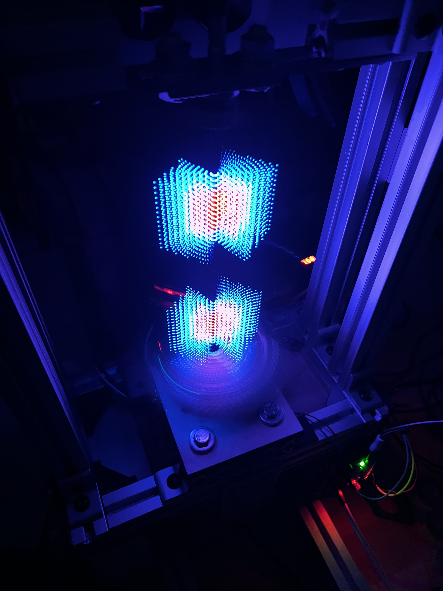
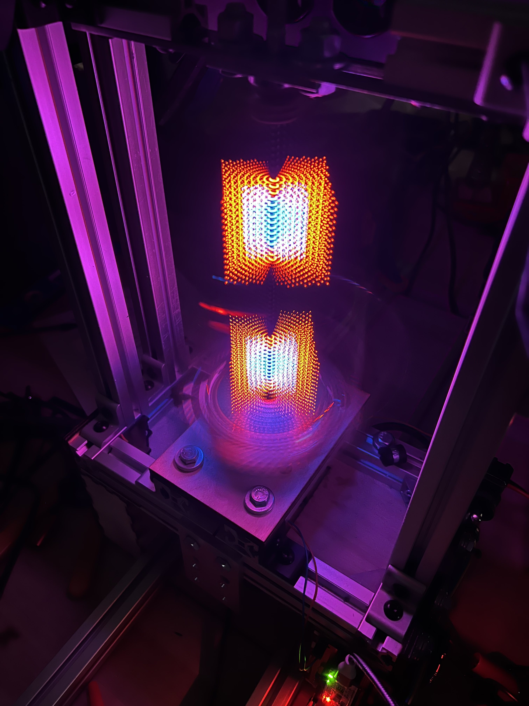

# Notes
In showcasing the performance of the produced volumetric display, the problem arises that cameras do not perfectly imitate human vision. Human vision exhibits a phenomenon referred to as "persistence of vision", in which light appears to the viewer even after its source has stopped emitting it. This delay is what allows us to understand film as continuous motion and not a series of images.\
\
Cameras operate by sampling the incoming light at discrete intervals. Their sample rate is often fast enough to capture the desired action, however this is not the case for the designed volumetric display. The system design demands that each pixel is only active for a small fraction of the display time. This means that even with a sample rate  fast enough to capture one frame for every LED array update (64 updates per frame * 12 frames per second  yields a required frame rate of 768 fps), the captured video might still produced an effect similar to aliasing due to the display's dead-time. Most phone cameras cannot achieve this rate, so the produced video will exhibit aliasing, shown in the video below.

However, we can find a workaround. Photos taken with long exposure times can approximate the effect of persistence of vision. The following photos were taken with long exposure times, and closely reflect the appearance of the volumetric display to a direct viewer, which is displaying two cubes stacked vertically. 

